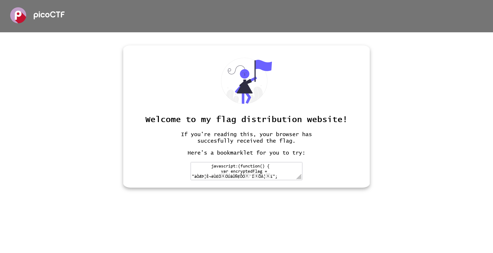

# Bookmarklet:Web Exploitation:50pts
Why search for the flag when I can make a bookmarklet to print it for me?  
Browse [here](http://titan.picoctf.net:57091/), and find the flag!  

Hints  
1  
A bookmarklet is a bookmark that runs JavaScript instead of loading a webpage.  
2  
What happens when you click a bookmarklet?  
3  
Web browsers have other ways to run JavaScript too.  

# Solution
The URL is passed. When I accessed it, it was the following site.  
  
A bookmarklet is passed. 
The contents were as follows. 
```js
        javascript:(function() {
            var encryptedFlag = "àÒÆަȬë٣֖ÓÚåÛÑ¢Õӗ¨Í•ÕĦ–í";
            var key = "picoctf";
            var decryptedFlag = "";
            for (var i = 0; i < encryptedFlag.length; i++) {
                decryptedFlag += String.fromCharCode((encryptedFlag.charCodeAt(i) - key.charCodeAt(i % key.length) + 256) % 256);
            }
            alert(decryptedFlag);
        })();
```
Paste it into your browser's developer tools and run it (you can leave 'javascript:' as is). Then 'picoCTF{p@g3_turn3r_18d2fa20}' and flag were alerted.

## picoCTF{p@g3_turn3r_18d2fa20}