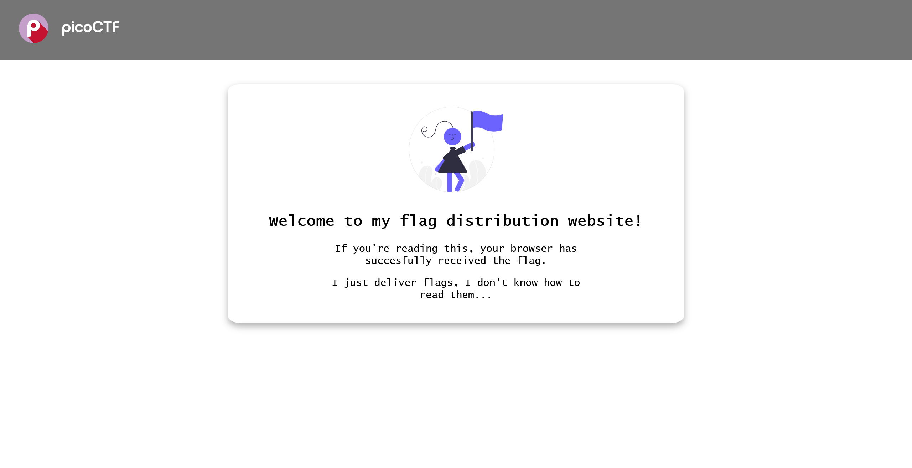

# Unminify:Web Exploitation:100pts
I don't like scrolling down to read the code of my website, so I've squished it. As a bonus, my pages load faster!  
Browse [here](http://titan.picoctf.net:53048/), and find the flag!  

Hints  
1  
Try CTRL+U / ⌘+U in your browser to view the page source. You can also add 'view-source:' before the URL, or try `curl <URL>` in your shell.  
2  
Minification reduces the size of code, but does not change its functionality.  
3  
What tools do developers use when working on a website? Many text editors and browsers include formatting.  

# Solution
The URL is passed.  
When I accessed it, it was the following site.  
  
If you look at the source, it seems to be minified, and as the problem name suggests, it seems to unwind and look for the flag.
```bash
$ curl -s 'http://titan.picoctf.net:53048/' | grep -Po 'picoCTF{.*?}'
picoCTF{pr3tty_c0d3_ed938a7e}
```
I grep and found it.  

## picoCTF{pr3tty_c0d3_ed938a7e}